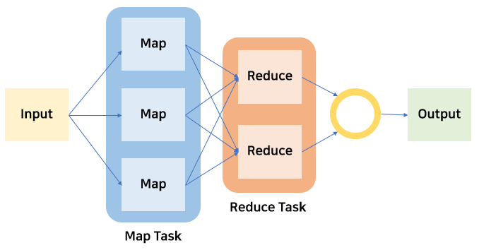

# Hadoop

- 대용량 데이터를 분산 처리할 수 있는 자바 기반의 오픈 소스 프레임워크 
- 하둡이 개발되면서 빅데이터 분석이 쉬워짐 
- 여러개의 컴퓨터를 하나로 묶어 대용량 데이터를 처리함 
- DBMS가 아니고 **프레임워크** ! 

 

## 핵심 기술 
- HDFS와 MapReduce의 2가지 핵심 기술 
- Master-Slave 구조로 구성되어 있음 

#

### HDFS
- 하둡의 **데이터 저장 시스템**
- 빅데이터 파일을 여러대의 서버에 분산 저장하기 위한 파일 시스템 
- 구글의 파일 시스템에서 시작 
- 여러대의 서버에 데이터를 저장하고, 저장된 각 서버에서 동시에 데이터를 처리 
- 64MB 단위로 데이터 관리 
- 필요한 것은 복제하여 분산 저장함

#

* **Master(NameNode) - Slave(DataNode)** 

  * NameNode 
  
    * 파일 시스템 유지를 위해 Metadata(전체적인 구조) 관리 
    * 데이터노드 모니터링 → 3초마다 heartbeat 전송 
    * 블록 관리 → 장애가 발생한 데이터노드의 블록을 새로운 데이터노드에 복제 
    
  * DataNode 
  
    * 클라이언트가 HDFS에 저장하는 파일을 로컬 디스크에 유지 
    * 실제 저장되는 데이터 

#
 
### MapReduce 
- 대용량 데이터 처리를 위한 분산 프로그래밍 모델 
- 분산 병렬 처리를 위한 분석 시스템 
- Data → 분산 DB에 저장 → 통합 처리 vs 분산 처리 

* **Map-Reduce 시스템** 
 
  * Map 
   
    * 각각의 분산된 컴퓨터에서 처리하는 것 
    * 분산할 데이터를 저장한 서버에서 진행 
    * 흩어져 있는 데이터를 (key,value) 형태로 연관성 있는 데이터 분류로 묶는 작업 
    * key : 키워드 / value : 갯수 
 
  * Reduce 
  
    * 각각의 분석 결과를 모아서 통합 
    * 분석 결과를 도출할 서버에서 진행 
    * Filtering과 Sortinㅎ을 거쳐 데이터를 추출 
    * Map화한 작업 중 중복 데이터를 제거하고 원하는 데이터를 추출하는 작업 
   
#

### YARN
  
 

## Hadoop EcoSystem
- 하둡의 기능을 보완하는 서브 오픈소스 소프트웨어들로 구성 

### 빅데이터 수집 
- 플럼(Flume) : 비정형 데이터 수집 
- 스쿱(Sqoop) : 관계형 DB로부터 데이터 가져오기 

### 빅데이터 저장, 활용 
- Hbase : 컬럼 기반의 NoSQL 데이터베이스 

### 빅데이터 처리 
- 하이브(Hive) : 유사 SQL 기반 빅데이터 처리 
- 피그(Pig) : 스크리브 언어 기반 빅데이터 처리 
- 마후트(Mahout) : 기계학습 알고리즘 기반 빅데이터 처리 

### 빅데이터 관리 
- 우지(Oozie) : 빅데이터 처리 프로세스 관리 
- H카탈로그(HCatalog) : 빅데이터 메타 정보 관리 
- 주키퍼(Zookeeper) : 빅데이터 서버 시스템 관리 

