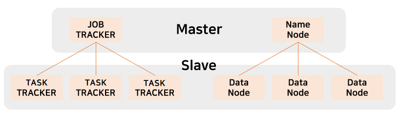

# Hadoop

- 대용량 데이터를 분산 처리할 수 있는 자바 기반의 오픈 소스 프레임워크 
- 하둡이 개발되면서 빅데이터 분석이 쉬워짐 
- 여러개의 컴퓨터를 하나로 묶어 대용량 데이터를 처리함 
- DBMS가 아니고 **프레임워크** ! 

 

## 핵심 기술 
- HDFS와 MapReduce의 2가지 핵심 기술 
- Master-Slave 구조로 구성되어 있음 

#

### HDFS
- 하둡의 **데이터 저장 시스템**
- 빅데이터 파일을 여러대의 서버에 분산 저장하기 위한 파일 시스템 
- 구글의 파일 시스템에서 시작 
- 여러대의 서버에 데이터를 저장하고, 저장된 각 서버에서 동시에 데이터를 처리 
- 64MB 단위로 데이터 관리 
- 필요한 것은 복제하여 분산 저장함

#

* **Master(NameNode) - Slave(DataNode)** 

  * **NameNode** 
  
    * 파일 시스템 유지를 위해 Metadata(전체적인 구조) 관리 
    * 데이터노드 모니터링 → 3초마다 heartbeat 전송 
    * 블록 관리 → 장애가 발생한 데이터노드의 블록을 새로운 데이터노드에 복제 
    
  * **DataNode** 
  
    * 클라이언트가 HDFS에 저장하는 파일을 로컬 디스크에 유지 
    * 실제 저장되는 데이터 

#
 
### MapReduce 
- 대용량 데이터 처리를 위한 분산 프로그래밍 모델 
- 분산 병렬 처리를 위한 분석 시스템 
- Data → 분산 DB에 저장 → 통합 처리 vs 분산 처리 

* **Map-Reduce 시스템** 
 
  * **Map** 
   
    * 각각의 분산된 컴퓨터에서 처리하는 것 
    * 분산할 데이터를 저장한 서버에서 진행 
    * 흩어져 있는 데이터를 (key,value) 형태로 연관성 있는 데이터 분류로 묶는 작업 
    * key : 키워드 / value : 갯수 
 
  * **Reduce** 
  
    * 각각의 분석 결과를 모아서 통합 
    * 분석 결과를 도출할 서버에서 진행 
    * Filtering과 Sortinㅎ을 거쳐 데이터를 추출 
    * Map화한 작업 중 중복 데이터를 제거하고 원하는 데이터를 추출하는 작업 
   
#

### YARN
- Yet Another Resource Negotiator 
* **MapReduce의 단점을 극복**하기 위해 하둡 2.0부터 등장 

  * 기존 MapReduce에서는 JobTracker에 의해 리소스가 관리되기 때문에 Hadoop이 설치된 클러스터 서버들의 리소스를 사용하려는 다른 컴퓨팅 클러스터와 연동하기가 어려웠음 
  * 이 문제를 해결하기 위해 기존 MapReduce 중에서 클러스터의 리소스를 관리하는 부분만 가져와 다른 서비스에서도 사용 가능하도록 구성한 시스템이 YARN 
  
* 기존 MapReduce보다는 기능적으로 간단
* 범용적인 분산 리소스 시스템을 위해 MapReduce의 클러스터 관리 체계보다 더 복잡하고 다양한 기능을 제공함 

  

#

* 역할에 따라 컴포넌트 세분화 
  
  

**MasterNode**
* **ResourceManager** 

  * JobTracker의 역할 
  * 클러스터 전체 리소스 내에서 다양한 종류의 애플리케이션이 동작할 수 있도록 총괄 
  * 수집한 노드의 리소스 정보를 바탕으로 애플리케이션이 동적할 때 어떤 노드에서 얼만큼의 리소스를 할당할지 결정 
  * 클러스터 내의 NodeManager들과 통신하여 할당된 자원과 사용중인 자원의 상황을 알 수 있음 
  
  * **ApplicationManager** 
  
    * 애플리케이션 실행 
    * 실행하기 위한 리소스 컨테이너를 Scheduler에게 요청 
    
  * **Scheduler** 
  
    * 스케줄링 
    * 애플리케이션의 실행을 스케줄링하면서 노드의 자원 상태에 따라 컨테이너를 할당 
      → YARN 클러스터의 리소스를 사용하고자 하는 다른 플랫폼으로부터 요청을 받아 리소스를 할당함 
      
 

**WorkerNode**
* **NodeManager** 

  * TaskTracker의 역할 
  * YARN 클러스터의 Worker 서버로, ResourceManager를 제외한 모든 서버에 실행 
  * 노드당 한개씩 존재 
  * 노드의 cpu 메모리, 네트워크 상태 정보와 같은 리소스를 관제하고 ResourceManager에게 주기적으로 리포팅 및 heartbeat를 보냄 
  * 워커 노드에 컨테이너 생성 
  
  * **Container** 
    * 한정된 리소스를 사용하여 ApplicationMaster의 워커 노드로써 애플리케이션을 실행 
  
  * **ApplicationMaster** 
    * 실행 상태를 관제하면서 컨테이너의 상태를 추적 
    * 실행이 완료되면 ApplicationManager에게 완료되었음을 알림 
    * 완료 되기 전에 문재가 발생하여 비정상 종료가 되면, 다른 워커 노드에 다시 할당하여 애플리케이션이 재시작할 수 있도록 함 
  
 

## Hadoop EcoSystem
- 하둡의 기능을 보완하는 서브 오픈소스 소프트웨어들로 구성 

### 빅데이터 수집 
- 플럼(Flume) : 비정형 데이터 수집 
- 스쿱(Sqoop) : 관계형 DB로부터 데이터 가져오기 

### 빅데이터 저장, 활용 
- Hbase : 컬럼 기반의 NoSQL 데이터베이스 

### 빅데이터 처리 
- 하이브(Hive) : 유사 SQL 기반 빅데이터 처리 
- 피그(Pig) : 스크리브 언어 기반 빅데이터 처리 
- 마후트(Mahout) : 기계학습 알고리즘 기반 빅데이터 처리 

### 빅데이터 관리 
- 우지(Oozie) : 빅데이터 처리 프로세스 관리 
- H카탈로그(HCatalog) : 빅데이터 메타 정보 관리 
- 주키퍼(Zookeeper) : 빅데이터 서버 시스템 관리 

