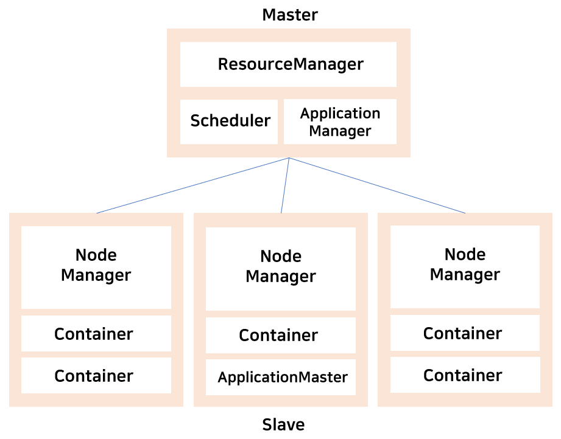
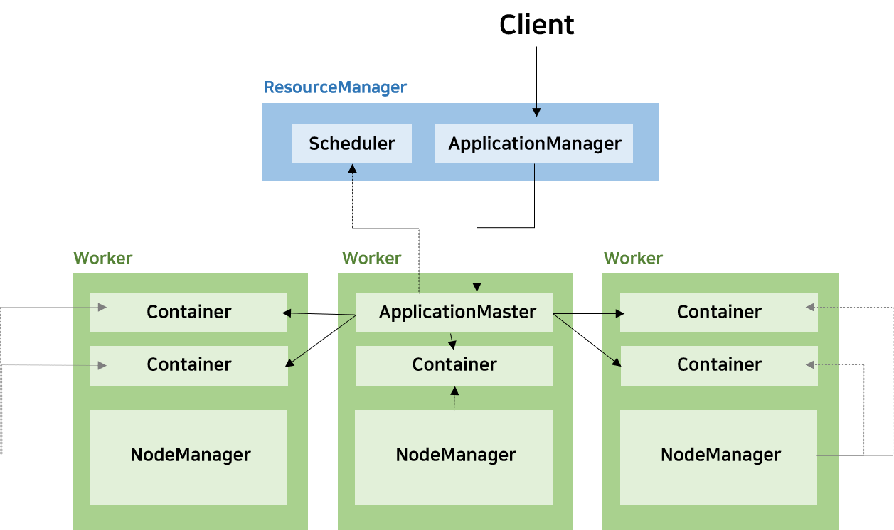

### YARN

- Yet Another Resource Negotiator 
* **MapReduce의 단점을 극복**하기 위해 하둡 2.0부터 등장 

  * 기존 MapReduce에서는 JobTracker에 의해 리소스가 관리되기 때문에 Hadoop이 설치된 클러스터 서버들의 리소스를 사용하려는 다른 컴퓨팅 클러스터와 연동하기가 어려웠음 
  * 이 문제를 해결하기 위해 기존 MapReduce 중에서 클러스터의 리소스를 관리하는 부분만 가져와 다른 서비스에서도 사용 가능하도록 구성한 시스템이 YARN 
  
* 기존 MapReduce보다는 기능적으로 간단
* 범용적인 분산 리소스 시스템을 위해 MapReduce의 클러스터 관리 체계보다 더 복잡하고 다양한 기능을 제공함 

  * 하둡 1.0에서는 MapReduce 프레임워크로 작성된 애플리케이션만 실행하고 관제할 수 있었지만, YARN이 생기면서 YARN API를 이용하여 작성된 다양한 애플리케이션의 실행 환경을 지원함 
  * 하둡 이외의 장치 없이 클러스터 전체의 리소스를 관리, 관제하면서 리소스가 허용하는 범위 내에서 여러 개의 애플리케이션을 동시에 실행할 수 있게 됨 

#

### YARN - Component 
  
  

**MasterNode**
* **ResourceManager** 

  * JobTracker의 역할 
  * 클러스터 전체 리소스 내에서 다양한 종류의 애플리케이션이 동작할 수 있도록 총괄 
  * 수집한 노드의 리소스 정보를 바탕으로 애플리케이션이 동적할 때 어떤 노드에서 얼만큼의 리소스를 할당할지 결정 
  * 클러스터 내의 NodeManager들과 통신하여 할당된 자원과 사용중인 자원의 상황을 알 수 있음 
  
  * **ApplicationManager** 
  
    * 애플리케이션 실행 
    * 실행하기 위한 리소스 컨테이너를 Scheduler에게 요청 
    
  * **Scheduler** 
  
    * 스케줄링 
    * 애플리케이션의 실행을 스케줄링하면서 노드의 자원 상태에 따라 컨테이너를 할당 
      → YARN 클러스터의 리소스를 사용하고자 하는 다른 플랫폼으로부터 요청을 받아 리소스를 할당함 
      
 

**WorkerNode**
* **NodeManager** 

  * TaskTracker의 역할 
  * YARN 클러스터의 Worker 서버로, ResourceManager를 제외한 모든 서버에 실행 
  * 노드당 한개씩 존재 
  * 노드의 cpu 메모리, 네트워크 상태 정보와 같은 리소스를 관제하고 ResourceManager에게 주기적으로 리포팅 및 heartbeat를 보냄 
  * 워커 노드에 컨테이너 생성 
  
  * **Container** 
    * 한정된 리소스를 사용하여 ApplicationMaster의 워커 노드로써 애플리케이션을 실행 
  
  * **ApplicationMaster** 
    * 실행 상태를 관제하면서 컨테이너의 상태를 추적 
    * 실행이 완료되면 ApplicationManager에게 완료되었음을 알림 
    * 완료 되기 전에 문재가 발생하여 비정상 종료가 되면, 다른 워커 노드에 다시 할당하여 애플리케이션이 재시작할 수 있도록 함 
  
 

* YARN은 외부로의 특별한 요청이 없으면 아무런 동작도 수행하지 않음
  
  * NodeManager - 자신의 상태만 계속해서 ResourceManager로 보냄 
  * ResourceManager - 클러스터 전체 리소스 상황에 대한 현황 관리만 수행 
  
* YARN 자체만으로는 할 수 있는 것이 아무것도 없고, YARN을 사용하는 또 다른 무언가가 있어야 함 

  * MapReduce나 Spark 같은 분산 컴퓨팅 플랫폼이나, Hbase 등과 같은 클러스터 기반 시스템 등 
  
