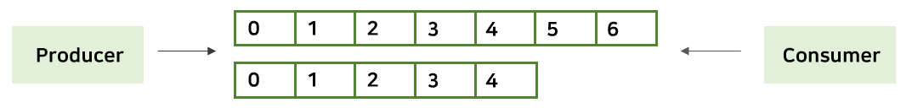
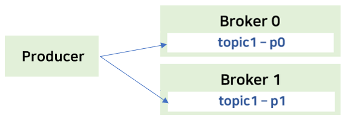
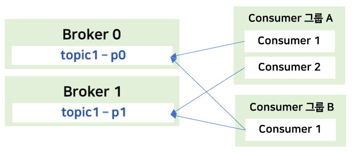

# Apache kafka 

### 정의 
**실시간으로 기록 스트림을 게시, 구독, 저장 및 처리할 수 있는 분산 데이터 스트리밍 플랫폼**
- 여러 소스에서 데이터 스트림을 처리하고 여러 사용자에게 전달할 수 있음 
- 필요한 모든 곳에서 대규모 데이터를 동시에 이동할 수 있음 
- 스트리밍 데이터를 처리하는 기업 인프라를 위한 고부가 가치 기능 
- 링크드인이 개발, 2011년 초 최종적으로 오픈 소스화 

#

### 특징 
**pub-sub 모델의 메시지 큐 (발행/구독 모델)**
- 메시지를 특정 수신자에게 직접적으로 보내주는 시스템 X
- **Publisher**는 메시지를 **topic**을 통해 카테고리화 함 
- 분류된 메시지를 받기 원하는 receiver(**subscriber**)는 해당 토픽을 구독하면 메시지를 읽을 수 있음 
- 즉, publisher와 subscriber는 **서로에 대해서는 모르고, topic에 대해서만 알고 있음**   

> 메시지 큐 : 키보드나 마우스를 통해 발생하는 사용자의 입력을 메시지로 전달하는 윈도우즈 시스템에서, 어떤 프로세스에 대한 메시지를 저장하기 위해 할당된 큐. 윈도우즈 시스템의 모든 스레드에 존재

#

**메시지를 파일 시스템에 저장 (기존 메시징 시스템은 메모리에 저장)**
- 별도의 설정을 하지 않아도 **데이터의 영속성(durability)** 이 보장됨 
- 메시지를 많이 쌓아두어도 성능이 크게 감소하지 않음 
- 많은 메시지를 쌓아둘 수 있기 때문에, **실시간 처리**뿐만 아니라 **주기적인 작업에 사용할 데이터를 쌓아두는 용도**로도 사용 가능
- Consumer에 의해 처리된 메시지를 바로 삭제하지 않고 파일 시스템에 그대로 두었다가 **설정된 수명이 지나면 삭제**   
  → 메시지 처리 도중 문제가 발생하거나 처리 로직이 변경되었을 경우 consumer가 처음부터 다시 처리하도록 할 수 있음(rewind)

#

**분산 환경에 특화된 설계**
- 고성능의 분산 이벤트 스트리밍 플랫폼
- 병렬 처리 가능 

#

### 구성 요소 

**kafka cluster** 
- 메시지 저장소 
- 하나의 카프카 클러스터는 여러 개의 브로커로 구성됨 

**Broker**
- 카프카 각각의 서버
- 메시지를 나누어 저장/ 처리/ 장애시 대처 등 
- 데이터 이동에 필요한 핵심 역할
- 주키퍼와 연동됨 
- 여러 개의 브로커 중 1대는 controller의 기능을 수행 함   
  → 각 브로커에게 담당 파티션 할당을 수행하고 정상 동작 모니터링 관리 (컨트롤러에 대한 정보는 주키퍼에 저장) 
  
**Zookeeper cluster**
  - 카프카 클러스터와 관련된 정보를 관리 (Metadata 저장) 
  - 카프카를 띄우기 위해서는 주키퍼가 반드시 실행되어야 함 
  
**Producer**
  - 카프카 클러스터에 메시지를 보냄 
  - 메시지를 만들고 topic에 씀 
  - 컨슈머의 존재를 알지 못함 
  
**Consumer**
  - 메시지를 카프카에서 읽어 옴 
  - 메시지를 소비하는 주체 
  - 컨슈머도 프로듀서의 존재를 모름 
  - topic을 구동함으로써 자신이 메시지를 스스로 조절해가며 소비할 수 있음    
    → 브로커로부터 자신의 처리 능력만큼의 메시지만 가져오기때문에 최적의 성능을 낼 수 있음 
 
 #
 
 ### Topic & Partition 
 
 
 
 
 
 **Topic**
 - 메시지를 구분하는 단위 (파일 시스템의 폴더와 유사)
 - 한 개의 토픽은 한 개 이상의 파티션을 구성 
 > 수 많은 메시지가 동시에 쓰여질 때, 파티션이 하나이면 처리가 너무 버거우므로 여러 개의 파티션을 두어 분산 저장    
   → 병렬 처리 되어 시간 절약 
 - 프로듀서와 컨슈머는 토픽을 기준으로 메시지를 주고 받게 됨 
 
#

 
 
 
 **Partition**
 - 메시지를 저장하는 물리적인 파일 
 - 파티션은 추가만 가능 (**append-only**)
 
 - **offset** : 각각의 메시지가 저장되는 위치 (배열의 index와 유사)
 > 프로듀서가 넣은 메시지는 차례대로 offset 값을 가지면서 파티션의 맨 뒤에 추가 (중간에 삽입 X)   
 > 컨슈머는 offset 기준으로 메시지를 순서대로 읽음 (섞어서 읽을 수 없음)    
 > 메시지는 바로 삭제 되지 않고, 설정에 따라 **일정 시간이 지난 뒤 삭제** 
 
 - 한 번 늘린 파티션은 절대로 줄일 수 없음
 > 파티션을 늘린 경우, 메시지는 **round-robin 방식** 으로 쓰여져서 메시지 순서가 중요한 모델일 경우 위험할 수 있음 
 

#

### Producer & Consumer 

**Producer**
- **ound-robin** OR **Key** 를 이용하여 파티션 선택
- 같은 키를 갖는 메시지는 같은 파티션에 저장됨    
  → 같은 키를 가지면, 순서가 유지됨 
  

**Consumer**
- **Consumer group**에 속함 (컨슈머들의 묶음) 
- 한 개의 파티션은 컨슈머 그룹 내 한 개의 컨슈머에만 연결이 가능 
> 컨슈머 그룹에 속한 컨슈머들은 한 파티션을 공유할 수 없음   
> 한 컨슈머 그룹 기준으로, 파티션의 메시지는 순서대로 처리함    
> 한 개의 파티션을 서로 다른 그룹의 컨슈머끼리는 공유할 수 있음    
> **파티션 개수 >= 컨슈머 개수**

